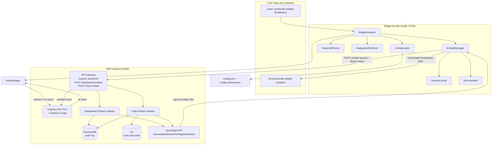

<!--
Copyright Amazon.com, Inc. or its affiliates. All Rights Reserved.
SPDX-License-Identifier: Apache-2.0
-->

# Architecture

The Generic QuickSuite Widget is a two-part reference architecture: a
self-contained browser **widget** and a serverless **backend** that mints
QuickSight embed URLs for registered users only.

## Data flow

## Components

### Widget (browser)

| Component | Responsibility |
|---|---|
| **WidgetInitializer** | Orchestrates startup: detect container, load config, parse deep links, render nav, init the embedding SDK, load the first view. |
| **ConfigLoader** | Fetches `config.json` (relative to the script URL) and validates it against `config.schema.json` before anything renders. |
| **DeepLinkParser** | Reads `tab`/`item`/`view`/`prompt` from the URL and `data-initial-*` attributes, sanitizes them, and resolves the initial state (URL wins over data attributes). |
| **NavigationRenderer** | Renders the tab bar and secondary sub-navigation from config; all CSS is scoped to the container. Re-renders across the 768px mobile/desktop breakpoint. |
| **EmbedManager** | Talks to the QuickSight Embedding SDK. Fetches embed URLs from the backend, caches them, and uses in-place sheet navigation when only the sheet changes. |
| **SessionCache** | Stores embed URLs in `sessionStorage` with timestamps; reuses them until `session.expirationMinutes` elapses. |
| **ErrorHandler** | Loading indicator, exponential-backoff retry (1s/2s/4s) on timeout or 5xx, configurable error state with a Retry button, and a busy state for pool exhaustion. |
| **AuthManager** | Cognito Hosted UI login: redirects unauthenticated viewers to log in, captures the returned id token, tracks expiry, and supplies the bearer token for embed requests. Inert when no `auth` block is configured. |

### Backend (AWS SAM)

| Resource | Responsibility |
|---|---|
| **Cognito User Pool** | Authenticates end users via the Hosted UI. The API Gateway authorizer validates its tokens. |
| **API Gateway** | Two POST routes: `/dashboard-embed` and `/chat-embed`. HTTPS only. A Cognito authorizer rejects unauthenticated requests with 401. |
| **Dashboard Embed Lambda** | Validates origin + dashboard-ID allowlist + body size, resolves the embed identity from the verified token claims (per-user or shared mode), calls `GenerateEmbedUrlForRegisteredUser`, writes an async audit log. |
| **Chat Embed Lambda** | Resolves the authenticated user (per-user or shared mode) and mints a Q&A embed URL. When run without auth (anonymous mode), it falls back to least-recently-used rotation over an S3-persisted pool, returning 503 + `Retry-After` when exhausted. |
| **DynamoDB table** | Audit log (timestamp, origin, dashboard ID, session ID, status) with TTL-based expiration. |
| **S3 bucket** | Persists chat user-pool assignment state across Lambda invocations. |
| **Per-Lambda IAM roles** | Least privilege: only the specific QuickSight/DynamoDB/S3 actions each function needs, scoped to resource ARNs. No anonymous embedding permission. |

## Key design decisions

- **Registered-user embedding only.** The backend never calls
  `GenerateEmbedUrlForAnonymousUser`; every embed URL is tied to a registered
  QuickSight reader identity.
- **Config-driven UI.** Navigation structure, branding, and session settings
  live entirely in `config.json` — no code changes to re-skin or re-point.
- **Single script tag.** The widget auto-initializes on load and inlines the
  Embedding SDK when built as a bundle, so host pages need no build tooling.
- **Efficient navigation.** Switching sheets within the same dashboard uses the
  SDK's in-place navigation and the cached embed URL, avoiding a backend round
  trip.
